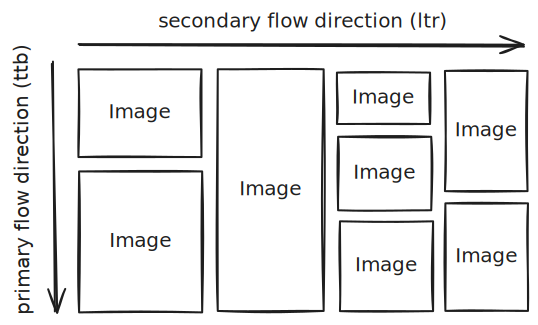
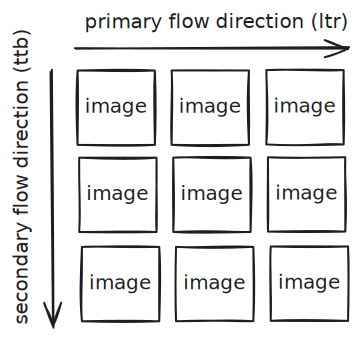

# Typst package: `tesselate`

`tesselate` is a package for combining multiple images into masonry or matrix layout. Sometimes in a document you want to put multiple images together, but it could be a challenge to layout them nicely, as different images may have different aspect ratios and you must precisely calculate the sizes of each image to to make sure that they fit into a rectangular region. This package aims to automate such calculation process and provide the desired layout as long as you pass in the images.

## Masonry layout



Masonry layout is the layout format that stacks images continuously in a primary direction into groups and then stack the groups in a secondary direction. We assume the primary direction be top-to-bottom and secondary direction be left-to-right in the following section. In this case, images are first separated into columns. In each column, the images share the same width, and all columns share the same total height.

Given the images in each columns, it requires the images' aspect ratios and the gap between images and columns to calculate the exact size of each image. The `masonry` function provided by `tesselate` completes the calculation and lays out the images as long as you pass in the images in each column.


```typst
#import "@preview/oxifmt:1.0.0": strfmt
#import "@preview/tesellate:x.y.z": masonry

// 3 images of cats
#let cat-images = range(1, 4).map(i => image(strfmt("assets/image/cat{:}.jpg", i)))
// 3 images of dogs
#let dog-images = range(1, 4).map(i => image(strfmt("assets/image/dog{:}.jpg", i)))

// wrap images in each column into a sub-array
// if a column contains 1 image only then you may omit the array and just pass in the image
#masonry(
  // column 1, with 2 cat images
  (
    cat-images.at(0),
    cat-images.at(1),
  ),
  // column 2, with 1 cat image
  cat-images.at(2),
  // column 3, with 3 dog images
  dog-images,
  // add gap between images
  gutter: 1em,
)
```

`masonry` by default uses the original aspect ratio of each image. This can be changed by wrapping the `image` into a `masonry-item` and passing the `aspect-ratio` argument. `aspect-ratio` is defined as the ratio of image height over width.

```typ
#masonry(
  // column 1, with 2 cat images
  (
    masonry-item(
      cat-images.at(0),
      aspect-ratio: 1,
    ),
    cat-images.at(1),
  ),
  // column 2, with 1 cat image
  cat-images.at(2),
  // column 3, with 3 dog images
  dog-images,
  // add gap between images
  gutter: 1em,
)
```

# Matrix layout




Matrix layout lays out images in grids. This format is often seen in social media posts and CAPTCHAs. In matrix layout you can specify the number of rows and columns. By default all rows and columns have the same width and height, and the images have aspect ratio of 1. Currently, row and column widths must be specified in `fr`. The absolute length for `1fr` is equal in horizontal and vertical direction, and the matrix layout by default fills up the horizontal space available

